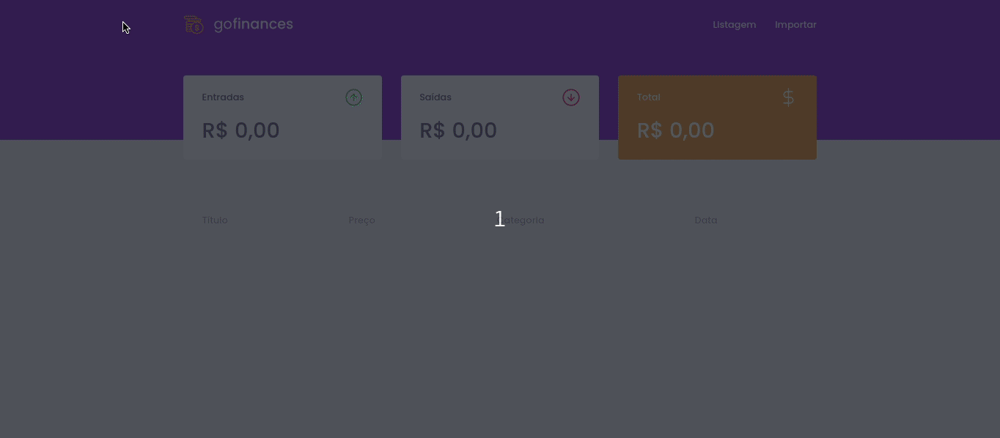

<h1 align="center">
  
</h1>

<p align="center">
  <a href="#rocket-technologies">Technologies</a>&nbsp;&nbsp;&nbsp;|&nbsp;&nbsp;&nbsp;
  <a href="#-about-the-project">About the project</a>&nbsp;&nbsp;&nbsp;|&nbsp;&nbsp;&nbsp;
  <a href="#-layout">Layout</a>&nbsp;&nbsp;&nbsp;|&nbsp;&nbsp;&nbsp;
  <a href="#-getting-started">Getting started</a>&nbsp;&nbsp;&nbsp;|&nbsp;&nbsp;&nbsp;
  <a href="#-how-to-contribute">How to contribute</a>&nbsp;&nbsp;&nbsp;|&nbsp;&nbsp;&nbsp;
  <a href="#memo-license">License</a>
</p>




## :rocket: Technologies

This project was developed with the following technologies:

- [TypeScript](https://www.typescriptlang.org/docs/home.html)
- [Node.js](https://nodejs.org/en/)
- [React](https://reactjs.org)

## 💻 About the project 

GoFinances is a project created to store all your financial transactions, displaying all entries and expenses and balance. 

To record all the data, the system offers a CSV import option.

## 🔖 Layout

You can view the layout of this project through this [link](https://www.figma.com/file/EgOhyj1Inz14dhWGVhRlhr/GoFinances?node-id=1%3A863)

To access this link, you must have a [Figma](https://www.figma.com/) account


## 💻 Getting started

### Requirements

- [Node.js](https://nodejs.org/en/)
- [Yarn](https://classic.yarnpkg.com/)
- One instance of [PostgreSQL](https://www.postgresql.org/)
- [DBeaver](https://dbeaver.io/)

> Obs.: I recommend use docker

**Clone the project and access the folder**

```bash
$ git clone https://github.com/AndersonUfop/goFinances-GoStack.git && cd gofinances-GoStack
```

**Follow the steps below**

### Backend

```bash
# Starting from the project root folder, go to backend folder
$ cd Backend

# Install the dependencies
$ yarn

# Create the instance of postgreSQL using docker
$ docker run --name gofinances-postgres -e POSTGRES_USER=docker -e POSTGRES_PASSWORD=docker -p 5432:5432 -d postgres

# Create a new connection witch Postgres in DBeaver

# Create a database with name gofinances-postgres

# Make sure the keys in 'ormconfig.json' to connect with your database
# are set up correctly.

# Once the services are running, run the migrations
$ yarn typeorm migration:run

# To finish, run the api service
$ yarn dev:server

# Well done, project is started!
```

### Web

_Obs.: Before to continue, be sure to have the API running_

```bash
# Starting from the project root folder, go to frontend folder
$ cd Web

# Install the dependencies
$ yarn

# Be sure the file 'src/services/api.ts' have the IP to your API

# Start the client
$ yarn start
```


## 🤔 How to contribute

- Fork this repository;
- Create a branch with your feature: `git checkout -b my-feature`;
- Commit your changes: `git commit -m 'feat: My new feature'`;
- Push to your branch: `git push origin my-feature`.

After the merge of your pull request is done, you can delete your branch.

## :memo: License
This project is licensed under the MIT License - see the [LICENSE](LICENSE) file for details.


Made with 💜 by Anderson Fernandes 👋 [See my linkedin](https://www.linkedin.com/in/anderson-fernandes-8b5a50135/)

---

##  README versions

[Portuguese 🇧🇷](./README.md)  |  [English 🇺🇸](./README-en.md)
